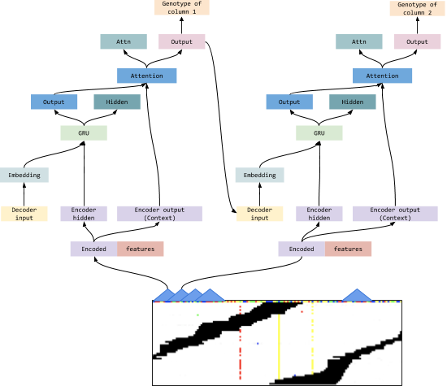

# F.R.I.D.A.Y
FRIDAY uses a machine translation model to identify variants in human genome. The model uses popular text translation model to identify variants in human genome. The encoder model is a CNN-RNN based encoding scheme that performs allele specific encoding. The decoding scheme uses attention to decode the variant and predicts a variant in this process. This process is more natural than traditional CNN based variant callers as it effectively takes genome context in account while predicting variants. This model is heavily designed for experiment purposes and the optimization for distribution will be done as we find the most effective model.

 ## The encoder
 The encoder uses a traditional structure to encode features from each of the alleles. We construct the images based on two alleles present in each site and the encoding scheme encodes features captured from each allele specific image.

    

## The Decoder
The decoder unrolls the encoded features from left to right. In this process we use an attention later to take the context in account. This is very popular in machine translation models.

 

    

## Setup and run

Louise will do this
